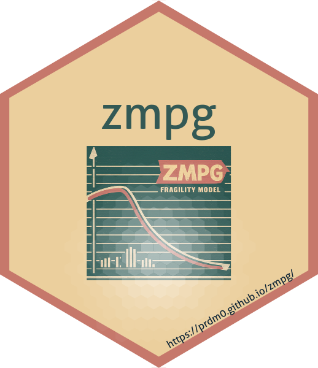

<!-- README.md is generated from README.Rmd. Please edit that file -->

```{r, include = FALSE}
knitr::opts_chunk$set(
  collapse = TRUE,
  comment = "#>",
  fig.path = "man/figures/README-",
  out.width = "100%"
)
```

# zmpg package 

<!-- badges: start -->
<!-- badges: end -->

This library provides useful functions for survival analysis, in particular, it implements the Zero-Modified Generalized Poisson - ZMPG survival model. ZMPG is a distribution function of a discrete random variable that, through it, the ZMPG model is constructed. This discrete random variable is what is called frailty and gives rise to the ZMPG frailty model which is continuous in time. Functions are provided for the numerical calculation of cumulative distribution functions, survival functions, and hazard functions based on a base probability density function - PDF base. The probability generating functions of the Geometric Poisson distribution and ZPMG are also available. In addition, the package also provides functions to work with the inference of the ZMPG frailty model and for plotting the improper density function of the ZMPG frailty model, the cumulative distribution function, survival function, and hazard function.

## Installation

The package is being versioned on GitHub. You can install the development version of [zmpg](https://github.com/prdm0/zmpg), and to do this, you must first install the [remotes](https://cran.r-project.org/web/packages/remotes/index.html) package and then run the following command:

``` r
# Install zmpg package
remotes::install_github("prdm0/zmpg", force = TRUE)
```

The `force = TRUE` argument is not necessary. It is only needed in situations where you have already installed the package and want to reinstall it to have a new version.

## Example

For more details about the functions available in the package, please refer to the [**Reference**](reference/index.html) tab at the top of this page. There you will find some small usage examples for each of the exported functions, as well as a better understanding of what each one does, what arguments are needed, and what returns are expected.

Most of the functions use the concept of closures, so they are functions that build useful functions. For example, in the following code, the pdf_fragility_zmpg function is a function that receives a base probability density function, which is passed to the pdf argument. This function returns a function in terms of the arguments:

+ `t` - survival time $t > 0$. This argument is vectorized so you can pass a vector of survival times;
+ `phi` - dispersion parameter $\phi \geq 0$ of the ZMPG frailty model distribution;
+ `rho` - parameter $\rho \geq 0$ of the ZMPG frailty model;
+ `...` - other arguments that the base probability density function may require.

In the following example, the `dweibull` function is passed as an argument to the `pdf_fragility_zmpg` function. The `dweibull` function is the probability density function of the Weibull distribution that is already implemented in the [R](https://search.r-project.org/CRAN/refmans/ExtDist/html/Weibull.html) language. However, you could also implement any probability density function you wish, not limiting yourself to the base densities that are implemented in [R](https://www.r-project.org/).

```{r example}
# remotes::install_github("prdm0/zmpg")
library(zmpg) 
# install.packages("cowplot")
library(cowplot)

zmpg_weibull <- zmpg::pdf_fragility_zmpg(dweibull)

# Improper density function of the ZMPG-Weibull fragility model
density <-
  zmpg_weibull(
    t = seq(0.001, 3, length.out = 50L),
    mu = 10.7,
    phi = 2.6,
    rho = 3.1,
    shape = 2.5,
    scale = 1.2
  )

# Cumulative distribution function of the ZMPG-Weibull fragility model
cdf <-
  zmpg::cdf_function(zmpg_weibull)(
    t = seq(0.001, 3, length.out = 50L),
    mu = 10.7,
    phi = 2.6,
    rho = 3.1,
    shape = 2.5,
    scale = 1.2
  )

# Survival function of the ZMPG-Weibull fragility model
survival <-
  zmpg::survival_function(zmpg_weibull)(
    t = seq(0.001, 3, length.out = 50L),
    mu = 10.7,
    phi = 2.6,
    rho = 3.1,
    shape = 2.5,
    scale = 1.2
  )

# Hazard function of the ZMPG-Weibull fragility model
hazard <-
  zmpg::hazard_function(zmpg_weibull)(
    t = seq(0.001, 3, length.out = 50L),
    mu = 10.7,
    phi = 2.6,
    rho = 3.1,
    shape = 2.5,
    scale = 1.2
  )

# Useful plots

p_1 <- plot(density)
p_2 <- plot(cdf)
p_3 <- plot(survival)
p_4 <- plot(hazard)

plot_grid(p_1, p_2, p_3, p_4, labels = c('A', 'B', 'C', 'D'))
```

